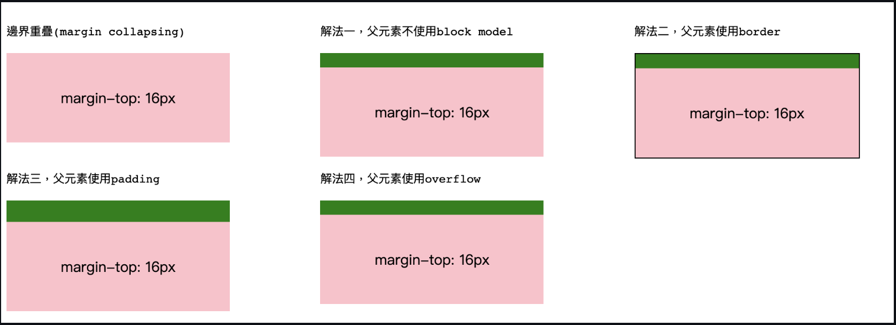
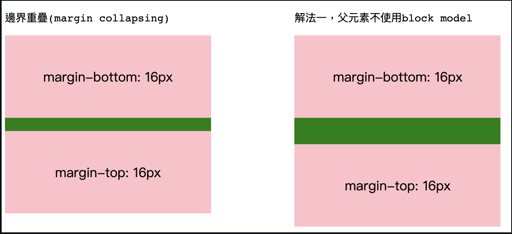

+++
title = 'Css系列 - 如何避免邊界重疊 ( Margin Collapsing )'
date = 2020-06-03T12:00:00+08:00
draft = false
featured_image = 'featured_image.png'
description = '當兩個 block 都有設定邊界，且兩個邊界重疊時，只留下最大值的邊界，這個情況就是邊界重疊'
tags = ['Frontend', 'CSS']
+++

> 這是以前在 GitHub 寫的文章，現在搬遷過來，所以有一些歷史 XD

### 邊界重疊 (Margin Collapsing)
當兩個block都有設定邊界，且兩個邊界重疊時，只留下最大值的邊界，這個情況就是邊界重疊
但設有float, position: absolute的元件不會發生上述的事情
#### 有三個情況會造成邊界重疊
1. 同一層相鄰時若設定邊界時，上下邊界會造成重疊
1. 父元素與第一個或最後一個子元素若設定邊界時，上下邊界會造成重疊
1. 兩個元素中間有空的元素時，若這兩個元素有設定邊界，上下邊界會造成重疊

#### 同一層相鄰時若設定邊界時，上下邊界會造成重疊

```scss
// .scss
.mt-16 {
  margin-top: 16px;
}

.mb-16 {
  margin-bottom: 16px;
}
```
```html
<!-- html -->
<section>
  <div class="block mb-16">margin-bottom: 16px</div>
  <div class="block mt-16">margin-top: 16px</div>
</section>
```
雖然兩個都設定margin，但因為相鄰，所以上下邊界會重疊，
就不是預想的32px而是16px了，以下圖例，綠色為margin的範圍(16px)


#### 父元素與第一個或最後一個子元素若設定邊界時，上下邊界會造成重疊

```scss
// .scss
.mt-16 {
  margin-top: 16px;
}

```
```html
<!-- html -->
<section class="mt-16">
  <div class="block mt-16">margin-top: 16px</div>
</section>
```
當父元素有設定margin, 第一個元素也有設定margin，
父元素為block且沒有設定border, padding, overflow時，
就會變成第一個元素與父元素共享同個margin，所以不會分開來，就重疊了，
以下圖例，綠色為margin的範圍(16px)



#### 兩個元素中間有空的元素時，若這兩個元素有設定邊界，上下邊界會造成重疊
```scss
// .scss
.mt-16 {
  margin-top: 16px;
}

.mb-16 {
  margin-bottom: 16px;
}
```
```html
<!-- html -->
<section>
  <div class="block mb-16">margin-bottom: 16px</div>
  <div class="block mt-16">margin-top: 16px</div>
</section>
```
雖然兩個元素沒有相鄰，但因為空的元素導致他們實質上是相鄰的，所以會有case1的事情發生，
以下圖例，綠色為margin的範圍(16px)



[原檔程式碼](https://codepen.io/marshal604/pen/pojXyre?editors=1100)

[參考文章 MDN 理解邊界重疊的原因](https://developer.mozilla.org/zh-TW/docs/Web/CSS/CSS_Box_Model/Mastering_margin_collapsing)
