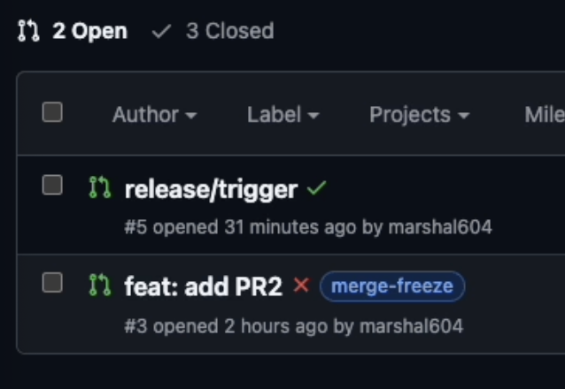

+++
title = '如何用 GitHub Workflow 實現自動 Freeze Main Branch'
date = 2025-06-09T10:00:00+08:00
draft = false
featured_image = 'featured_image.png'
tags = ['DevOps', 'GitHub Workflow', 'Working Notes']
+++

# 如何用 GitHub Workflow 實現自動 Freeze Main Branch

## 當前狀況

公司現行採用 GitHub Flow 進行分支管理。雖然我們大致上每週 Release 新版本，但有時會因 Hotfix 或功能實驗，導致 Release 節奏被打亂，產生以下問題：

1. main branch 可能被提前合併未來要 Release 的功能
2. 若上線後需修正，又要 revert 其他功能或暫時禁止合併
3. 需要人工確認各種狀態，流程繁瑣且易出錯

## 解決方案：Release PR + main branch Freeze

我們優化後的流程如下：

1. 每次 Release 時建立 Release PR，將本次要上線的功能統一合併，Release 完再 merge 回 main。
2. Release PR 存在期間，main branch 禁止合併任何新的 PR，僅能合併到 release branch。

## 這麼做的好處：

1. 所有 Release 內容一目了然，方便查驗和追蹤
2. 自動 freeze main branch，開發者一目瞭然，降低溝通成本，避免誤合併

## 如何自動 Freeze Main Branch？

GitHub 原生僅支援 手動鎖定分支，並無自動 freeze 功能。因此，我們設計兩個 GitHub Workflow 來自動化：

### 1. Merge Freeze Blocker

1️⃣ Merge Freeze Blocker
用途：
阻止 PR 在 freeze 期間被合併進 main，保障 Release 階段穩定。

運作方式：

- 只要 PR 有 merge-freeze label，workflow 讓 PR 的檢查狀態失敗（failed），不能 merge
- 監控 PR 加/移除 label、內容同步時自動觸發
  顯示提示：「需先移除 merge-freeze 標籤才可合併」

2️⃣ Merge Freeze Labeler
用途：
自動管理 PR 上的 freeze 標籤，減少人工操作，防止遺漏或誤操作。

運作方式：

- 只要有 release/\* 開頭的 branch 開啟、同步或關閉 PR，此 workflow 自動執行
- 當 release PR 開啟或同步：自動幫所有「目標 main，來源非 release」的 open PR 加上 merge-freeze 標籤
- 當 release PR 關閉：自動移除上述 PR 的 freeze 標籤，恢復合併權限
  僅針對 release branch 操作，其餘不影響
- 額外處理：當其他 non-release PR 有內容更新時，會去確認當前 PRs 有沒有 open 的 release PR，有的話就加上 `merge-freeze` 標籤，沒有的話就移除。

## 結果圖

## 流程總結（對照表）

| 功能               | Workflow 名稱        | 主要作用                        |
| ------------------ | -------------------- | ------------------------------- |
| Freeze main branch | Merge Freeze Blocker | PR 有 freeze label 就擋合併     |
| 管理 freeze 標籤   | Merge Freeze Labeler | 自動加/移 freeze 標籤，控制時機 |

## 小結

透過 GitHub Workflow 實現自動 Freeze Main Branch，可以讓我們的 Release 流程更順暢，也可以讓我們的開發者更清楚知道什麼時候可以合併，什麼時候不能合併。
以下是這次實作的相關程式碼，有一個重點是，為了讓 label 可以正確被 trigger，我們不能透過內建的 `secret.GITHUB_TOKEN` 而是要自己建立 PAT (Personal Access Token) 來做 trigger。

https://github.com/marshal604/github-merge-freeze
