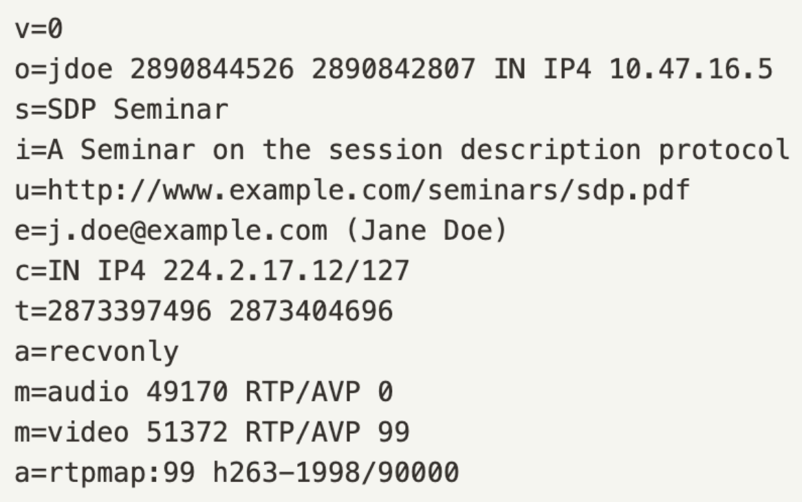
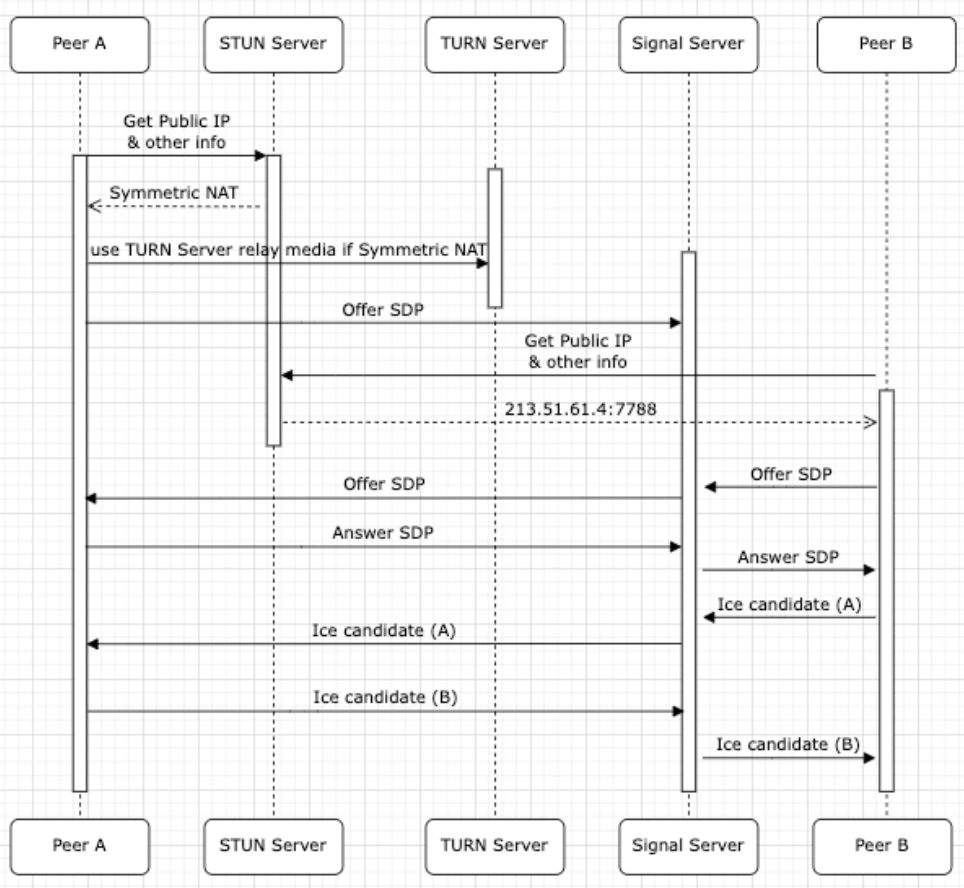

+++
title = 'WebRTC 運作原理入門：一次搞懂 SDP、ICE 與 NAT 穿透'
date = 2024-06-22T14:00:00+08:00
draft = false
featured_image = 'featured_image.png'
description = '整理 WebRTC 的基本概念與連線流程，包含 RTCPeerConnection、SDP 與 ICE Candidate，記錄連線中會用到的協定與概念'
tags = ['Frontend', 'WebRTC']
+++

## Overview

工作上開始接觸 RTC SDK 相關的開發，想起過去有分享過 WebRTC 的運作原理，趁著週末有空檔來重新複習一下。

## 什麼是 WebRTC？

**WebRTC** (Web Real-Time Communication) 是一個開放標準，用於在瀏覽器中不需安裝額外插件，即可實現**實時音訊、視訊和數據傳輸**。
基本上視訊會議都是透過 WebRTC 來實現，幾乎所有即時互動功能都會用到 WebRTC，而常見的的遊戲直播，基本上延遲會比較高，主要使用的技術應該是串流 (Streaming) 來實現，這邊要注意一下。

## WebRTC 的核心概念

我們可以透過模擬兩位董事長要進行開會來學習 WebRTC 的運作原理：

1. 告知秘書準備要開會: 創建 PeerConnection 實例，並設定 ICE 連線通道的名單
2. 董事長請秘書把名片交給對方： 使用 SDP 交換彼此的資訊
3. 確認要在哪個會議室進行談話: 使用 ICE 協定來確認彼此的網路狀態
4. 雙方開始進行對話: 完成 P2P 連線，開始進行對話

### 1. RTCPeerConnection：建立連線的起點

秘書就像是 **`RTCPeerConnection`** 實例，它是 WebRTC 連線的核心。我們需要先建立這個實例，才能開始後續的所有步驟。

而 PeerConnection 實例的創建，通常會在準備建立連線時就創建，這樣才能確保後續交換資訊與連線順利進行。

在創建實例時，我們通常會提供一組 **ICE 伺服器** (STUN/TURN) 的設定，這就像是告訴秘書可能有哪些會議地點可以選擇。

### 2. SDP (Session Description Protocol)：交換名片

在對談中我們需要知道名字，對方講什麼語言，興趣是什麼，才能順利的進行對話，而這在 WebRTC 裡就是透過 **SDP (Session Description Protocol)** 來交換彼此的資訊。

SDP 是一種描述媒體會話（例如音訊、視訊的編解碼器、傳輸協定等）的標準格式。

SDP 的格式如下


從以上可以知道這些資訊

```
📄 基本資訊
發起人 IP：10.47.16.5
會議名稱：SDP Seminar
主辦人信箱：j.doe@example.com
連線地址：224.2.17.12/127

🔊 音訊設定
傳輸協定與 Port：RTP/AVP over port 49170

🎥 視訊設定
傳輸協定與 Port：RTP/AVP over port 51372
```

所以 SDP 就像是我們要跟對方對話時，我們會先交換雙方的資訊，雙方才能根據彼此的編碼方式、媒體格式建立連線。

### 3. ICE (Interactive Connectivity Establishment)：尋找最佳會議室

就算我們交換了名片，但如果我們是在大馬路上交談，那很有可能會被汽車聲蓋過，所以需要找到一個適合的場所，例如咖啡廳就很棒。
在 WebRTC 中，這個過程就是透過 **ICE (Interactive Connectivity Establishment)** 協定來尋找兩端點之間最適合的通訊路徑。

ICE 會收集所有可能的連線候選位址 (Candidate)，並嘗試找出最有效的一條路徑。Candidate 主要分為三種類型：

- **Host Candidate**: 直接使用裝置的本地 IP 位址。適用於兩台裝置在同一個區域網路 (LAN) 的情況。
- **Server Reflexive Candidate (srflx)**：透過 **STUN (Session Traversal Utilities for NAT)** 伺服器，取得裝置在 NAT (網路位址轉換) 後方的公開 IP 位址。這是最常見的 NAT 穿透方式。
- **Relay Candidate (relay)**：當 STUN 失敗時（例如因為對稱型 NAT 或嚴格的防火牆），流量會透過 **TURN (Traversal Using Relays around NAT)** 伺服器進行中繼轉發。這是最可靠但成本最高、延遲也最高的方式。

ICE 會依序嘗試以下連線方式：

1.  **Host to Host**：嘗試直接連線。
2.  **Server Reflexive to Server Reflexive**：透過 STUN 伺服器找到的公開位址進行連線。
3.  **Relay to Relay**：透過 TURN 伺服器中繼所有流量。

視網路環境而定，但許多企業或教育網路環境常被防火牆阻擋，故最終會 fallback 到 TURN。

## 開始進行對話

到這邊基本上就是 ICE 連線完成後，雙方就可以看到彼此並進行對話

## WebRTC 完整連線流程

實務上，SDP 和 ICE candidate 過程中可以分開傳遞（稱為 Trickle ICE），也可以合併傳遞（非 Trickle ICE）。

文字版

```
A 創建 RTCPeerConnection
B 創建 RTCPeerConnection
A 加入影音裝置 (getUserMedia & addTrack)
B 加入影音裝置 (getUserMedia & addTrack)
A createOffer() -> A.setLocalDescription(offer)
B setRemoteDescription(offer)
B createAnswer() -> B.setLocalDescription(answer)
A setRemoteDescription(answer)
A addIceCandidate(B 的 ice candidate)
B addIceCandidate(A 的 ice candidate)
ICE 協定找到最佳路徑，P2P 連線成功
```

圖片版


## Signaling Server 的角色與總結

你可能會好奇，A 和 B 是如何交換 SDP 和 ICE Candidate 的？這就是 **Signaling Server** 的工作。WebRTC 本身不負責信令（Signaling）的傳遞，開發者需要自行建立一個信令通道，最常見的實作方式就是 **WebSocket**。

所有初始的溝通，包括 SDP Offer/Answer 和 ICE Candidates，都必須透過這個 **Signaling Server** 來中轉。一旦 ICE 成功建立 P2P 連線， **Signaling Server** 的階段性任務就完成了，後續的影音資料將直接在兩端點之間傳輸。

所以 **WebRTC 的 P2P 連線** 和 **Signaling 連線** 是兩條獨立的通道。現今的 RTC SDK 服務通常會將 Signaling Server 包裝好，讓開發者能更專注於前端的邏輯。

過去寫過的 RTC 連線實作 (純前端，無 Signaling Server) 可以參考 [WebRTC Demo](https://github.com/marshal604/webrtc-practice)
