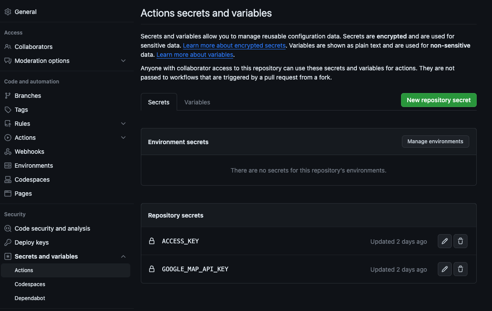

+++
title = '使用 GitHub Workflow 定期下載新北市實價登錄資料，以及使用 Google Geocoding API 將地址轉換為經緯度'
date = 2023-10-22T01:35:00+08:00
draft = false
description = '當我們不想要花錢找資料庫時，我們可以藉由 GitHub Workflow 來幫助我們定期的把資料存到 GitHub Repository 上'
featured_image = 'featured_image.png'
tags = ['GitHub Workflow', 'Google Cloud API']
+++
## 前言
---
最近想要抓實價登錄的資料來看，但是懶得去找可以免費 setup Server 的服務，但如果沒有一直在跑的 Server 怎麼去跑 Cron Job 來更新資料以及確保資料有被存放呢？
於是就想說試試 GitHub Workflow 能不能達成這件事 XDD

## 如何設計 GitHub Workflow
---
基本上設計流程如下
1. Trigger Workflow by Schedule
2. Run download-data Script
3. Commit and push changes

### Trigger Workflow by Schedule
我們可以使用官方提供的 [events-that-trigger-workflows#schedule](https://docs.github.com/en/actions/using-workflows/events-that-trigger-workflows#schedule) ，來達到這個方式，他的時間結構如下
```
* * * * *
┬ ┬ ┬ ┬ ┬
│ │ │ │ └─ 星期 (0 - 6)
│ │ │ └─── 月份 (1 - 12)
│ │ └───── 月中的某天 (1 - 31)
│ └─────── 小時 (0 - 23)
└───────── 分鐘 (0 - 59)
```

因為實價登錄是每 10 天更新，但我避免誤差，所以設定成每個月的 02 / 12 / 22 號，因此我們的 Workflow 一開始會長這樣



### Run download-data Script
我們先設計這個 Script 在 Workflow 如何運作，後續會再把程式碼的部分做交代，因此我們需要拉取現在的 Repository 並執行 download-data 的 Script




這邊的 `ACCESS_KEY` 要到 GitHub 頁面設定


接著點擊 `New repository secret` 就可以新增了，這邊我已經設置好稍後要用的 secret 了



### Commit and push changes
接著等下載完後，我們就可以把這些資料上傳到 GitHub 的 Repository 惹



## 如何設計 download-data Script
---
新北市實價登錄 API 可以到[這個網址](https://data.ntpc.gov.tw/openapi/swagger-ui/index.html?configUrl=%2Fapi%2Fv1%2Fopenapi%2Fswagger%2Fconfig&urls.primaryName=%E6%96%B0%E5%8C%97%E5%B8%82%E6%94%BF%E5%BA%9C%E5%9C%B0%E6%94%BF%E5%B1%80(724)#/)拿取，以下是實價登錄 API 回傳的格式

```
district(鄉鎮市區)、rps01(交易標的)、rps02(土地區段位置建物區段門牌)、rps03(土地移轉總面積平方公尺)、rps04(都市土地使用分區)、rps05(非都市土地使用分區)、rps06(非都市土地使用編定)、rps07(交易年月日)、rps08(交易筆棟數)、rps09(移轉層次)、rps10(總樓層數)、rps11(建物型態)、rps12(主要用途)、rps13(主要建材)、rps14(建築完成年月)、rps15(建物移轉總面積平方公尺)、rps16(建物現況格局-房)、rps17(建物現況格局-廳)、rps18(建物現況格局-衛)、rps19(建物現況格局-隔間)、rps20(有無管理組織)、rps21(總價元)、rps22(單價元平方公尺)、rps23(車位類別)、rps24(車位移轉總面積平方公尺)、rps25(車位總價元)、rps26(備註)、rps27(編號)、rps28(主建物面積)、rps29(附屬建物面積)、rps30(陽台面積)、rps31(電梯)

[
  {
    "district": "三峽區",
    "rps01": "房地(土地+建物)",
    "rps02": "新北市三峽區愛國路２-９號８樓之３",
    "rps03": "4.99",
    "rps04": "商",
    "rps05": null,
    "rps06": null,
    "rps07": "1111018",
    "rps08": "土地3建物1車位0",
    "rps09": "八層",
    "rps10": "13",
    "rps11": "住宅大樓(11層含以上有電梯)",
    "rps12": "住家用",
    "rps13": "鋼筋混凝土造",
    "rps14": "850311",
    "rps15": "55.74",
    "rps16": "1",
    "rps17": "1",
    "rps18": "1",
    "rps19": "有",
    "rps20": "有",
    "rps21": "有",
    "rps22": "10000",
    "rps23": "179",
    "rps24": null,
    "rps25": "0",
    "rps26": "0",
    "rps27": null,
    "rps28": "RPUNMLNKKIHGFIF68CC"
  },
  ...
]
```

因為我自己還有兩個需求
1. 未來想要放到 Map 上來看區域價格，但實價登錄的資料只有地址，所以需要串 Google Geocoding API 將地址轉換為經緯度(Geo location)
2. 因為實價每 10 天更新一次，所以歷史房價也是重要的數據，所以也需要儲存

那就讓我們來開工吧

### Download Data Script
我們分三個步驟

STEP1 拿取最新的實價登錄資料
STEP2 拿取已經存在本機的實價登錄資料
STEP3 合併資料並更新實價登錄價格的歷史資料寫進去 histories
STEP4 將還沒有 Geo location 的資料寫進去 location

大致上程式碼流程就會長像這樣



#### STEP1 拿取最新的實價登錄資料
[新北市實價登錄 API](https://data.ntpc.gov.tw/openapi/swagger-ui/index.html?configUrl=%2Fapi%2Fv1%2Fopenapi%2Fswagger%2Fconfig&urls.primaryName=%E6%96%B0%E5%8C%97%E5%B8%82%E6%94%BF%E5%BA%9C%E5%9C%B0%E6%94%BF%E5%B1%80(724)#/)目前有分很多地區區塊，所以我們先把要 fetch 的資料清單存到 datasets



然後要 fetch 的話， node 是沒內建 fetch，所以需要下載 node-fetch

```
yarn add node-fetch
```

接著我們就來 fetch 最新的實價登錄資料





因為現在 node v13 以上都支援 ES6 了，如果你遇到

```
SyntaxError: Cannot use import statement outside a module
```

可以到 package.json 加上 `"type": "module"`，如下


#### STEP2 拿取已經存在本機的實價登錄資料
我們預期存放實價登錄資料的資料會在 `house-pricing-list.json`



#### STEP3 合併資料並更新實價登錄價格的歷史資料寫進去 histories
這邊為了降低時間複雜度，所以我先把已經有的資料先存在 Map 中，然後當已經存在的資料再度出現時就存放到 histories 接著更改現有數值



#### STEP4 將還沒有 GeoLocation 的資料寫進去 location
參考 [Geocoding API](https://developers.google.com/maps/documentation/geocoding/start?hl=zh-tw)，我們得先去申請 [Google Cloud Platform](https://mapsplatform.google.com/) 創建項目


到剛剛創建的專案，選擇 API & Service


然後再填了一堆資料到最後 Submit


最後就會得到 API Key 惹


為了避免被惡意使用，還可以設置限定的網域或IP，這邊就限定我個人網域的，但測試時要先拔掉避免無法動彈XD


你可以到 Quota 去設置你的每日用量


接著我們就來撈取 location 吧，這邊回傳的資料會有 error_message 跟轉不出 Geo location 的數值，所以我直接 return



然後搭配 `getLatLng` 就能整理出我們要的 location 了



### 讓我們看看結果吧
接著只要時間到就會開始跑了，這邊我是用比較少的資料來跑，所以比較快，不然應該也要幾個小時


## 小結
---
原先只是想要使用 Google Map 來玩玩各地圖操作，不過剛好最近關注房市有看到實價登錄資料很適合用在 Map 上，但又懶得設置一堆雲服務，所以就嘗試把 GitHub 當作資料庫存著，所以主要是練習用，因為現在的 591租屋網、樂居網、樂屋網其實都有這些資料而且更詳細，所以若不是現有資料不滿足個人需求的話，是不用自己去打造自己的看價資料庫的。

