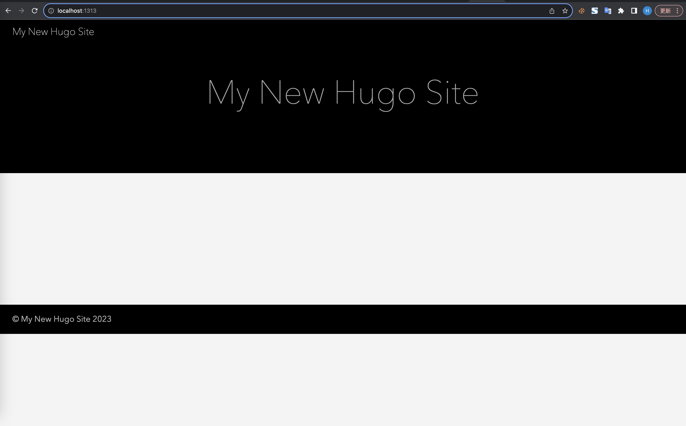
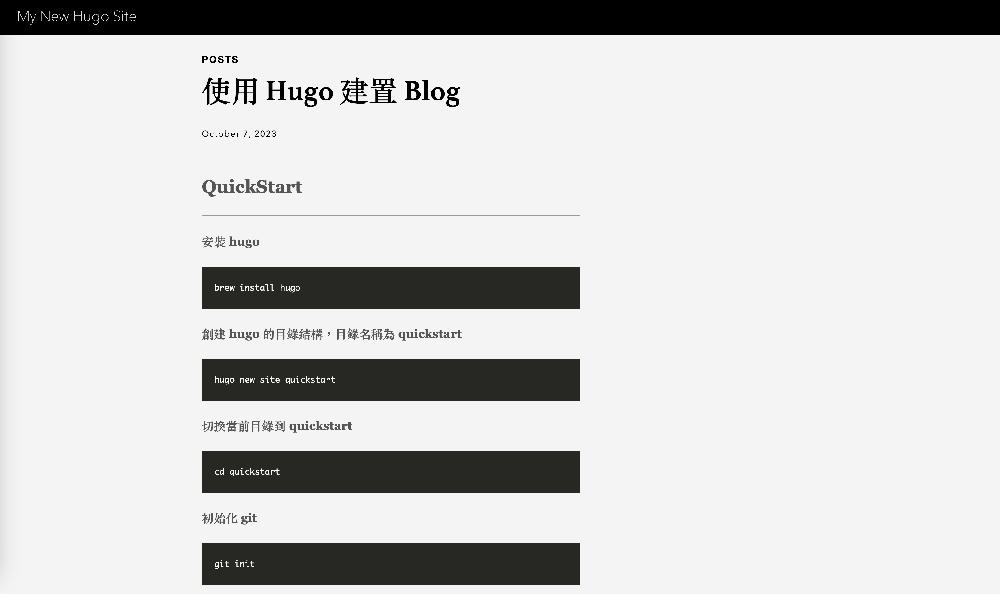
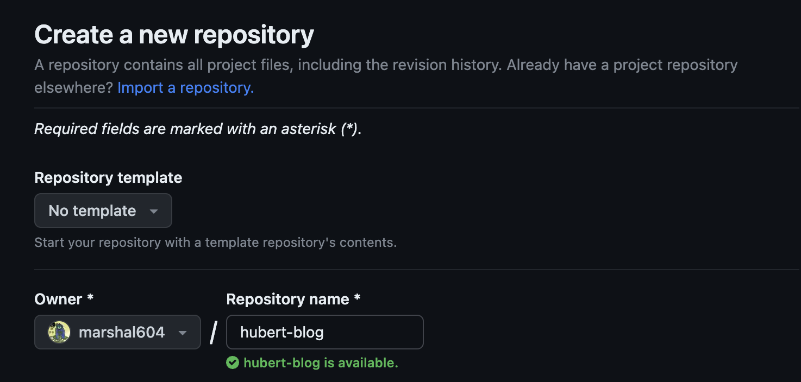

+++
title = '使用 Hugo 建置 Blog'
date = 2023-10-07T10:26:52+08:00
draft = true
+++

## QuickStart
---
#### 安裝 hugo
``` bash
brew install hugo
```
#### 創建 hugo 的目錄結構，目錄名稱為 quickstart
```bash
hugo new site quickstart
```
#### 切換當前目錄到 quickstart
```bash
cd quickstart
```
#### 初始化 git
```bash
git init
```
#### Clone Ananke 的 theme 到自己的 theme
```bash
git submodule add https://github.com/theNewDynamic/gohugo-theme-ananke.git themes/ananke
```
#### 設定現在的 theme 是 ananke
```bash
echo "theme = 'ananke'" >> hugo.toml
```
#### 啟動 server
```
hugo server
```
#### 啟動後大概就是長這個樣子


#### 創建第一個頁面

``` bash
hugo new content posts/my-first-post.md
```
#### 確認頁面的資料
```
+++
title: "My First Post"
date: 2023-10-07T10:26:52+08:00
draft: true
+++
```
#### 在底下就可以進行撰寫了，以下是我的文章內容
```MD
+++
title = '使用 Hugo 建置 Blog'
date = 2023-10-07T10:26:52+08:00
draft = false
+++

## QuickStart
---
#### 安裝 hugo
brew install hugo
#### 創建 hugo 的目錄結構，目錄名稱為 quickstart
hugo new site quickstart

```

#### 雖然剛剛新增了頁面，但其實你現在應該看不到這個頁面，所以要先終止原先的 hugo server 使用 development 模式才可以看到 draft 為 true 的頁面
以下兩個都可以
``` bash
hugo server --buildDrafts
```
```bash
hugo server -D
```

#### 接下來你就可以看到剛剛新增的頁面了
首頁

內容


#### 打開 hugo.toml 的檔案，設定網站
這是一開始創建好的資料
```
baseURL = 'https://example.org/'
languageCode = 'en-us'
title = 'My New Hugo Site'
theme = 'ananke'
```
- baseURL 需要調整成 production 用的網址
- languageCode 需要調整成當地語言跟地區
- title 需要調整成 production 用的網站標題
以下是我的調整
```
baseURL = 'https://hubertyang.blog/'
languageCode = 'zh-TW'
title = 'Hubert'
theme = 'ananke'
```
完成圖


## Deploy 網站
---
使用指令將網站打包起來，打包的內容不包含 draft 的資訊，可以在 public 資料夾中看到
```bash
hugo
```
#### Hugo 有提供很多 Deploy 的方式，這邊我會使用 Github 當作這次的示範
創建 Repository, 我取名叫做 hubert-blog

推送已經在本地建好的 Repository, marshal604 是我的，你要改成你的
```bash
git remote add origin git@github.com:marshal604/hubert-blog.git
git branch -M master
git push -u origin master
```


## Reference
- https://gohugo.io/getting-started/quick-start
- https://gohugo.io/hosting-and-deployment/hosting-on-github/
